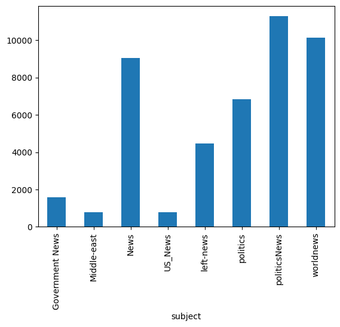
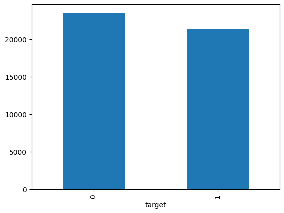
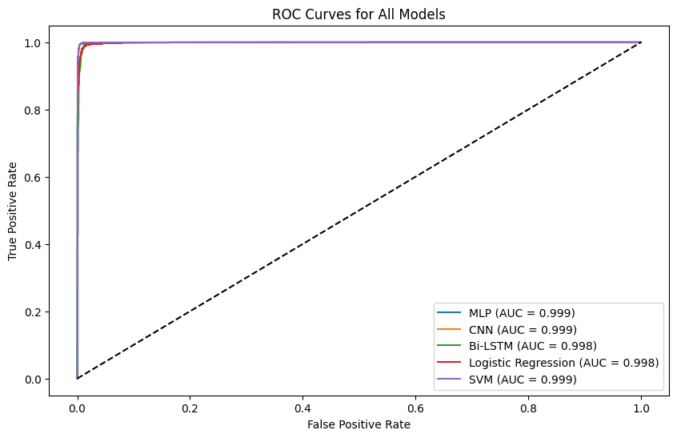
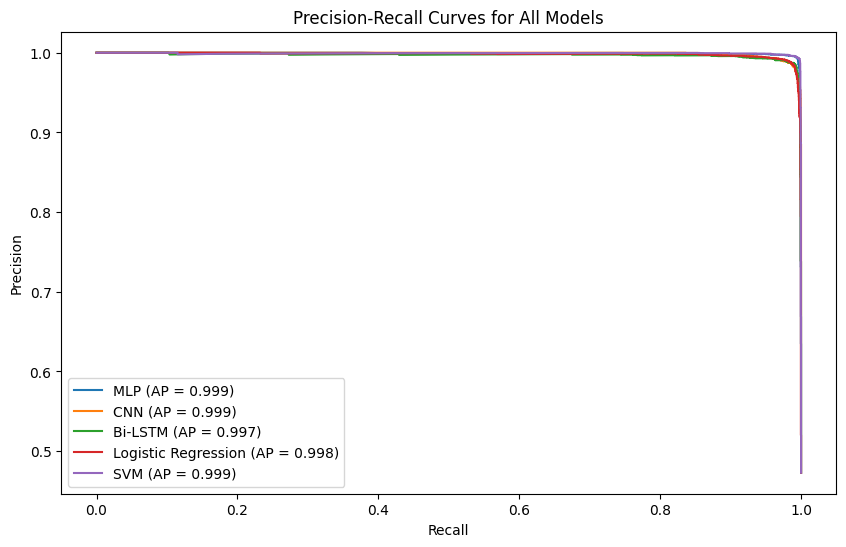
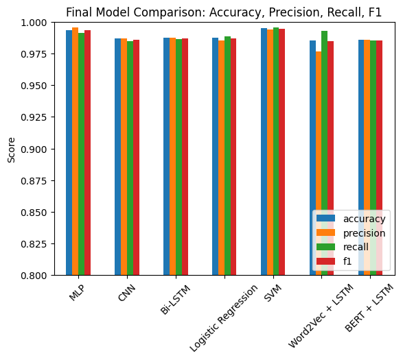
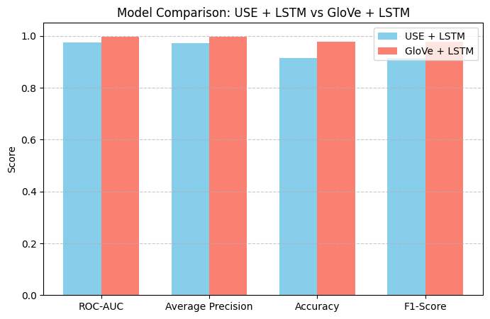
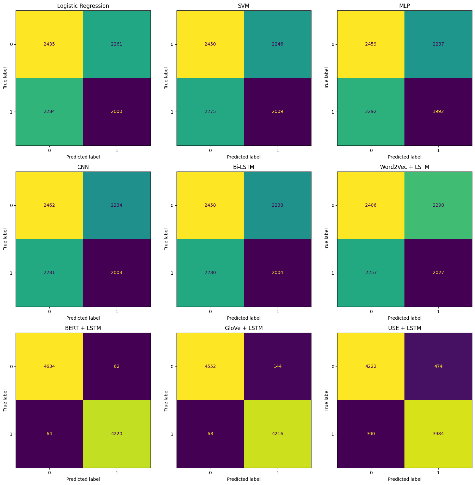

# Fake News Detection 📰

NLP project comparing 9 machine learning and deep learning models to classify news articles as real or fake. Built on a dataset of 44,898 articles using a full text preprocessing pipeline and multiple embedding strategies.

---

## 📊 Results

| Model | Accuracy | Precision | Recall | F1-Score | ROC-AUC |
|---|---|---|---|---|---|
| **SVM** | **99.49%** | 0.9937 | 0.9955 | **0.9946** | **0.9995** |
| MLP | 99.35% | 0.9953 | 0.9911 | 0.9932 | 0.9992 |
| Logistic Regression | 98.75% | 0.9852 | 0.9885 | 0.9868 | 0.9984 |
| Bi-LSTM | 98.74% | 0.9873 | 0.9861 | 0.9867 | 0.9980 |
| CNN | 98.66% | 0.9870 | 0.9847 | 0.9859 | 0.9991 |
| GloVe + LSTM | 97.64% | 0.9868 | 0.9731 | 0.9799 | 0.9972 |
| BERT + LSTM | 98.60% | 0.9855 | 0.9851 | 0.9853 | — |
| Word2Vec + LSTM | 98.53% | 0.9766 | 0.9927 | 0.9846 | — |
| USE + LSTM | 91.38% | 0.8932 | 0.9302 | 0.9113 | 0.9740 |

**Winner: SVM** — highest ROC-AUC (0.9995) and F1-Score (0.9946).

---

## 📈 Visualisations

### 1. Subject Distribution

### 2. Class Distribution

### 3. ROC Curves

### 4. Precision-Recall Curves

### 5. Model Comparison

### 6. USE vs GloVe

### 7. Confusion Matrices

---

## 🔄 NLP Pipeline

Text preprocessing steps applied to all 44,898 articles:

- Lowercasing + punctuation removal
- Tokenization (NLTK word_tokenize)
- Stopword removal
- Lemmatization (WordNetLemmatizer)
- TF-IDF Vectorization (max 5,000 features)

---

## 🧠 Models Implemented

**Classical ML (TF-IDF features)**
- Logistic Regression
- SVM (LinearSVC)

**Deep Learning (TF-IDF features)**
- MLP (128→64→1 with Dropout)
- CNN (Embedding + Conv1D + GlobalMaxPooling)
- Bi-LSTM

**Pretrained Embeddings**
- Word2Vec + Bi-LSTM (trained on corpus)
- GloVe (100d) + LSTM
- BERT (bert-base-uncased) + Bi-LSTM
- USE (Universal Sentence Encoder) + LSTM

---

## 📌 Key Findings

- SVM with TF-IDF outperformed all deep learning models including BERT
- MLP (simple feedforward) ranked 2nd — faster and more accurate than CNN/LSTM
- GloVe + LSTM achieved strong ROC-AUC (0.9972) with pretrained embeddings
- USE + LSTM performed worst — semantic sentence embeddings less effective than word-level for this task
- Dataset is nearly balanced (23,481 fake vs 21,417 real) — no oversampling needed

---

## 🛠️ Tech Stack

- **Python** — Pandas, NumPy
- **NLP** — NLTK, TF-IDF, Word2Vec (Gensim), GloVe, BERT (HuggingFace), USE (TF Hub)
- **Deep Learning** — TensorFlow, Keras
- **ML Models** — Scikit-learn
- **Visualisation** — Matplotlib, Seaborn

---

## ▶️ How to Run

1. Open notebook in **Google Colab**
2. Download dataset from Kaggle: [Fake and Real News Dataset](https://www.kaggle.com/datasets/clmentbisaillon/fake-and-real-news-dataset)
3. Upload `fake.csv` and `true.csv` to Colab
4. Run all cells

---

## 💡 Key Learnings

- Classical ML with good features (TF-IDF + SVM) can outperform complex deep learning models
- Pretrained embeddings (BERT, GloVe) don't always beat simpler approaches on well-structured datasets
- Lemmatization + stopword removal significantly improves model performance
- ROC-AUC is more reliable than accuracy for evaluating binary classifiers

---

## Dataset

[Kaggle — Fake and Real News Dataset](https://www.kaggle.com/datasets/clmentbisaillon/fake-and-real-news-dataset)  
44,898 articles | 23,481 fake · 21,417 real | 8 subjects

---

*Author: Meher Naaz*
